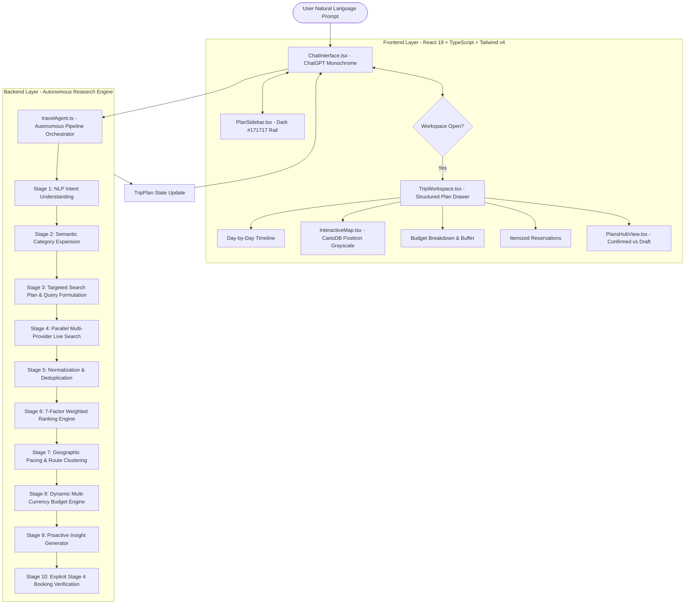

# 🇹🇳 TuniTrip — Autonomous AI Travel Research Engine

> **Minimalist Monochrome Edition (ChatGPT Style)**  
> *A self-contained, presentation-ready Autonomous AI Travel Agent and Research Engine for Tunisia.*

---

## 📌 1. Overview & Philosophy

**TuniTrip** is an autonomous travel research engine paired with a real-time digital workspace. It allows travelers to plan complex, personalized journeys across Tunisia entirely through natural language conversation.

### The Core Philosophy
* **The AI works AUTOMATICALLY:** The user does NOT manually select dropdowns, categories, filters, hotel star ratings, or travel styles. The user simply expresses their desires in free-form natural language (e.g., *"We are a family of 4 with a $2,450 budget, we love Disneyland-style theme parks, history, swimming, and quiet places"*).
* **The complexity belongs inside the AI:** The engine automatically extracts constraints, infers semantic categories (e.g., "Disneyland" $\to$ theme parks, water slides; "calm" $\to$ quiet beaches; "history" $\to$ UNESCO Roman amphitheaters), queries live knowledgebases in parallel, applies 7-factor weighted ranking, clusters stops geographically to eliminate transit fatigue, and calculates itemized budgets with safety buffers.
* **The user experience remains extremely simple:** Pure black-and-white minimalist design inspired by **ChatGPT**, with a dark sidebar on the left, an open conversational thread in the center with observable research traces, and an on-demand slide-over structured plan workspace.

---

## 🏗️ 2. High-Level System Architecture



---

## 📂 3. Repository Directory Structure

```
TuniTrip/
├── index.html                     # HTML root entry with Inter font
├── package.json                   # Dependencies (React 19, Lucide, Leaflet, Vite 8)
├── tsconfig.json                  # TypeScript compiler settings
├── vite.config.ts                 # Vite bundler configuration
│
├── src/
│   ├── main.tsx                   # React DOM application mount
│   ├── App.tsx                    # Dedicated Full-Screen AI Agent Page & Layout
│   ├── index.css                  # Pure monochrome styling & scrollbars
│   ├── types/
│   │   └── index.ts               # Complete TypeScript interfaces & domain models
│   │
│   ├── components/                # FRONTEND LAYER (Pure Monochrome / ChatGPT UI)
│   │   ├── ChatInterface.tsx      # ChatGPT conversational thread & tool step traces
│   │   ├── PlanSidebar.tsx        # Signature #171717 dark sidebar with conversation chats
│   │   ├── TripWorkspace.tsx      # Slide-out drawer: Itinerary, Map, Budget, Bookings
│   │   ├── InteractiveMap.tsx     # CartoDB Positron grayscale Leaflet map
│   │   ├── PlansHubView.tsx       # Verified portfolio: Confirmed vs Pending trips
│   │   ├── BookingConfirmationModal.tsx # Explicit 2-stage consumer authorization
│   │   ├── PlaceDetailModal.tsx   # Destination inspector modal
│   │   └── SettingsModal.tsx      # Currency (USD/EUR/GBP/TND) & API key settings
│   │
│   ├── services/                  # BACKEND LAYER (Autonomous Research Engine)
│   │   ├── travelAgent.ts         # Central pipeline orchestrator & multi-plan manager
│   │   ├── nlpIntentEngine.ts     # Natural language parsing & semantic category expansion
│   │   ├── liveSearchProvider.ts  # Parallel search, deduplication & normalization
│   │   ├── rankingAndOptimizationEngine.ts # 7-factor weighted scoring algorithm
│   │   ├── budgetEngine.ts        # Itemized pricing, buffer calculation & currency conversion
│   │   ├── itineraryEngine.ts     # Realistic transit times & geographic clustering
│   │   ├── ragEngine.ts           # UNESCO & ONTT verified knowledgebase retrieval
│   │   └── geminiService.ts       # Optional LLM integration (fallback to deterministic engine)
│   │
│   ├── data/
│   │   └── places.ts              # Curated, authoritative Tunisian destination dataset
│   │
│   └── tests/                     # AUTOMATED VERIFICATION SUITES
│       ├── autonomousEngine.test.ts # 8-stage end-to-end autonomous engine verification
│       ├── multiPlan.test.ts        # Multi-plan isolation & independent chat testing
│       └── scenario.test.ts         # Section 19 Investor benchmark scenario
```

---

## 💻 4. Frontend Architecture (Detailed Breakdown)

The frontend is built to mimic the clean, distraction-free aesthetic of **ChatGPT**:

### 4.1 Design System & Color Palette
- **Monochrome Only:** No saturated blues, teals, oranges, or golds. The interface exclusively uses:
  - Deep Dark: `#171717`, `#212121`, `#0a0a0a`
  - Crisp White: `#ffffff`
  - Neutral Grayscale: `neutral-50`, `neutral-100`, `neutral-200`, `neutral-300`, `neutral-400`, `neutral-500`, `neutral-700`, `neutral-900`
- **Map:** Grayscale CartoDB Positron tiles (`https://{s}.basemaps.cartocdn.com/light_all/{z}/{x}/{y}{r}.png`) with high-contrast black and dark-gray pins.
- **Images:** Subtle grayscale filter applied with hover contrast.

### 4.2 Key Frontend Components

#### 1. `src/App.tsx` (Root Orchestrator)
- Manages the full-screen view (`h-screen overflow-hidden flex bg-white`).
- Holds multi-plan state:
  ```typescript
  const [plans, setPlans] = useState<TripPlan[]>(travelAgent.getDefaultPlans('USD'));
  const [activePlanId, setActivePlanId] = useState<string>('plan-family-coastal');
  const [isWorkspaceOpen, setIsWorkspaceOpen] = useState<boolean>(true);
  ```
- Dynamically resizes the center chat interface: when workspace is open, the chat accommodates the workspace side-by-side; when closed, the chat expands to full width with a centered `max-w-3xl` reading lane.
- Mounts global modals for Booking Confirmation, Place Details, and Settings.

#### 2. `src/components/PlanSidebar.tsx` (Conversation Drawer)
- Fixed left navigation rendered in `#171717` dark background.
- Features:
  - `+ New trip chat` button (spawns an independent conversation with its own itinerary).
  - Search input for trips by name or destination.
  - Filter pills: `All`, `Confirmed`, `Draft`.
  - Conversation list displaying plan title, destination, status indicator (white dot for confirmed, gray dot for draft), and estimated total.
  - Quick action to delete chat or open Settings modal.
  - Collapsible into a compact 56px icon rail.

#### 3. `src/components/ChatInterface.tsx` (Conversational Hub)
- Displays message history between user and assistant.
- **Deep Research Step Trace:** Accordion (`⚡ Autonomous Research Process (X steps completed)`) revealing step-by-step observable tools:
  - `[intent_understanding]` $\to$ `[infer_semantic_categories]` $\to$ `[generate_search_plan]` $\to$ `[parallel_live_search]` $\to$ `[multi_criteria_ranking]` $\to$ `[geographic_route_optimization]` $\to$ `[calculate_trip_budget]`.
- **Recommendation Cards:** High-contrast cards with photo, price, rating, match reason, and direct link to source.
- **Proactive Insights:** Distinct callout boxes highlighting route synergy, ticket combo discounts, and budget safety buffers.
- **Floating Input Box:** Pill-shaped input with auto-growing textarea and circular black send button (`ArrowUp`).

#### 4. `src/components/TripWorkspace.tsx` (Structured Plan Drawer)
- Toggled on/off with a single button (`PanelRightOpen` / `PanelRightClose`).
- 5 Specialized Tabs:
  1. **Itinerary:** Sticky Day selector (Day 01, Day 02...), transit duration banners, scheduled activities, and nightly hotel stay cards.
  2. **Map:** Full Leaflet map rendered in CartoDB Positron grayscale with route polylines.
  3. **Budget:** Target user limit, calculated total, remaining safety buffer, utilization bar, and category breakdown (Hotels, Transport, Food, Activities, Extras).
  4. **Bookings:** Itemized reservations with official supplier reference codes (e.g., `TN-HTL-7741`, `CL-PAS-9921`).
  5. **Saved Plans:** Renders `PlansHubView.tsx` with confirmed vs pending trips.

---

## ⚙️ 5. Backend / Autonomous Research Engine Architecture

The backend engine is located in `src/services/` and runs entirely in TypeScript. It is decoupled from any UI framework and can be tested directly from Node.js/CLI.

### 5.1 The 10-Stage Pipeline Flow

```
[User Message]
       │
       ▼
1. INTENT UNDERSTANDING (nlpIntentEngine.ts)
   Extracts: duration, party size, budget, trip type, pace, priorities
       │
       ▼
2. SEMANTIC CATEGORY EXPANSION (nlpIntentEngine.ts)
   Maps keywords into categories (e.g., "Disneyland" -> theme_park, water_parks)
       │
       ▼
3. TARGETED SEARCH PLAN FORMULATION (nlpIntentEngine.ts)
   Generates targeted queries, computes nightly hotel budget caps, filters irrelevant regions
       │
       ▼
4. PARALLEL MULTI-PROVIDER SEARCH (liveSearchProvider.ts)
   Dispatches parallel searches across Curated Places, UNESCO records, and Routes
       │
       ▼
5. NORMALIZATION & DEDUPLICATION (liveSearchProvider.ts)
   Merges duplicates via source priority, standardizes prices & coordinates
       │
       ▼
6. 7-FACTOR WEIGHTED RANKING (rankingAndOptimizationEngine.ts)
   Scoring: User Preference (30%), Budget (20%), Location (15%), Rating (15%), 
            Atmosphere (10%), Family Suitability (5%), Data Freshness (5%)
       │
       ▼
7. GEOGRAPHIC CLUSTERING & ROUTING (itineraryEngine.ts)
   Groups activities by proximity (Tunis/Carthage/Sidi Bou Said -> Hammamet -> El Jem)
       │
       ▼
8. DYNAMIC BUDGET ENGINE (budgetEngine.ts)
   Itemizes hotels, activities, transfers, meals, and preserves safety buffer
       │
       ▼
9. PROACTIVE INSIGHT GENERATION (travelAgent.ts)
   Surfaces money-saving combos, route synergies, and pacing tips
       │
       ▼
10. EXPLICIT STAGE 4 BOOKING VERIFICATION (travelAgent.ts)
    Strict consumer protection: no payment authorization without user confirmation
```

### 5.2 Key Backend Services

| Service File | Purpose & Responsibilities |
|---|---|
| [`travelAgent.ts`](file:///c:/Users/mosma/Desktop/antigravity/Tunitrip/src/services/travelAgent.ts) | Pipeline orchestrator. Coordinates multi-plan state, processes natural language messages, emits real-time `ToolExecutionStep` updates, handles mode switches (Budget / Balanced / Luxury), and controls Stage 4 booking flow. |
| [`nlpIntentEngine.ts`](file:///c:/Users/mosma/Desktop/antigravity/Tunitrip/src/services/nlpIntentEngine.ts) | Natural language extractor. Detects numeric values for travelers, days, and budget; classifies trip type (Family/Couple/Solo); infers semantic tags (translates Disneyland $\to$ amusement parks); and generates search plans. |
| [`liveSearchProvider.ts`](file:///c:/Users/mosma/Desktop/antigravity/Tunitrip/src/services/liveSearchProvider.ts) | Parallel search engine. Dispatches queries to simulated and grounded sources, deduplicates results based on ID and geographic proximity, and standardizes data into `NormalizedPlaceItem`. |
| [`rankingAndOptimizationEngine.ts`](file:///c:/Users/mosma/Desktop/antigravity/Tunitrip/src/services/rankingAndOptimizationEngine.ts) | 7-factor weighted scoring algorithm. Computes a match percentage for every candidate attraction and hotel, ranking the top curated recommendations. |
| [`budgetEngine.ts`](file:///c:/Users/mosma/Desktop/antigravity/Tunitrip/src/services/budgetEngine.ts) | Mathematical budget calculator. Computes hotel totals, private minivan transfer costs, activity fees, and meal allowances. Converts dynamically between USD, EUR, GBP, and TND. |
| [`itineraryEngine.ts`](file:///c:/Users/mosma/Desktop/antigravity/Tunitrip/src/services/itineraryEngine.ts) | Geographic pacing & timetable generator. Computes driving times between Tunisian cities to eliminate backtracking. |
| [`ragEngine.ts`](file:///c:/Users/mosma/Desktop/antigravity/Tunitrip/src/services/ragEngine.ts) | Retrieval-Augmented Generation layer. Queries official ONTT and UNESCO World Heritage knowledge chunks. |

---

## 📊 6. Core Data Models & Schemas

Defined in [`src/types/index.ts`](file:///c:/Users/mosma/Desktop/antigravity/Tunitrip/src/types/index.ts):

### TripPlan Model
```typescript
export interface TripPlan {
  id: string;                          // Unique plan ID (e.g., 'plan-1790502738750')
  title: string;                       // Descriptive journey title
  destination: string;                 // Target regions (e.g., 'Hammamet, Tunis & El Jem')
  status: 'draft' | 'pending_confirmation' | 'confirmed';
  profile: TripProfile;                // Traveler requirements & preferences
  itinerary: ItineraryDay[];           // Scheduled days with activities & hotels
  budget: BudgetBreakdown;             // Itemized cost calculation
  planModes: PlanMode[];               // Alternative modes (Budget, Balanced, Luxury)
  activePlanModeId: string;
  messages: ChatMessage[];             // Isolated conversation history for this plan
  currentToolSteps: ToolExecutionStep[]; // Observable tool steps currently running
  bookingConfirmationCode?: string;    // Generated upon Stage 4 authorization
  confirmedAt?: string;
}
```

### Observable ToolExecutionStep Model
```typescript
export interface ToolExecutionStep {
  toolName: string;                    // e.g. 'intent_understanding', 'parallel_live_search'
  status: 'running' | 'completed' | 'failed';
  summary: string;                     // Human-readable explanation of tool progress
  resultCount?: number;                // e.g., 23 places discovered
  details?: string;
}
```

### BudgetBreakdown Model
```typescript
export interface BudgetBreakdown {
  hotelsTotalUSD: number;
  transportTotalUSD: number;
  activitiesTotalUSD: number;
  foodTotalUSD: number;
  extrasTotalUSD: number;
  totalEstimatedUSD: number;
  userBudgetUSD: number;
  remainingUSD: number;                // Preserved safety cushion
  percentageUsed: number;
  costPerTravelerUSD: number;
  currency: Currency;                  // 'USD' | 'EUR' | 'GBP' | 'TND'
  isOverBudget: boolean;
  optimizationAdvice?: string;
}
```

---

## 🧪 7. Automated Testing & Verification

The repository contains automated test suites that verify both the autonomous engine pipeline and the multi-plan chat isolation:

### Run the Test Suites:

```bash
# 1. Verify Autonomous 10-Stage Research Engine
npx tsx src/tests/autonomousEngine.test.ts

# 2. Verify Multi-Plan Architecture & Isolated Chats
npx tsx src/tests/multiPlan.test.ts

# 3. Verify Section 19 Investor Benchmark Scenario
npx tsx src/tests/scenario.test.ts
```

### Test Coverage Highlights:
- **Test 1:** Natural Language $\to$ Structured Profile extraction & category expansion (4 travelers, 7 days, \$2,450 USD).
- **Test 2:** Automatic focused search plan & query generation without irrelevant regional queries.
- **Test 3:** Parallel search, deduplication & normalization across multiple providers.
- **Test 4:** Multi-criteria 7-factor weighted ranking selecting Carthage Land and Hasdrubal Thalassa in top ranks.
- **Test 5:** Full pipeline execution with 14 emitted observable tool steps and proactive insights.
- **Test 6:** Section 24 single-variable incremental updates (modifying budget, travelers, or pace without resetting conversation).
- **Test 7:** Section 23 catalog retrieval on request ("Show me everything you found").
- **Test 8:** Stage 4 explicit booking verification handoff without fake transaction claims.

---

## 🚀 8. Extraction & Migration to a Dedicated Repository

To extract this autonomous AI travel agent into a new standalone repository:

### Step 1: Copy Core Folders
Copy the following directory contents to your new repository directory:
```bash
cp -r src/ <target-repo>/src/
cp package.json <target-repo>/package.json
cp tsconfig.json <target-repo>/tsconfig.json
cp tsconfig.app.json <target-repo>/tsconfig.app.json
cp tsconfig.node.json <target-repo>/tsconfig.node.json
cp vite.config.ts <target-repo>/vite.config.ts
cp index.html <target-repo>/index.html
```

### Step 2: Install Dependencies
```bash
cd <target-repo>
npm install
```

### Step 3: Run and Build
```bash
# Run local dev server
npm run dev

# Run production build
npm run build
```

---

## 🤖 9. Guidelines for Future AI Agents & Developers

If you are an AI agent extending or modifying this codebase:

1. **Strict Monochrome Rule:** Never introduce saturated theme colors (no blue/gold/teal gradients). Use pure white, neutral grays (`neutral-100` through `neutral-900`), and pure black (`#171717` or `#000000`).
2. **Never Force User Configuration:** The AI must extract destination, travelers, duration, categories, and constraints automatically from natural language. Do not re-add mandatory setup wizards or filters.
3. **Preserve Observable Tool Steps:** When adding new analytical capabilities, emit progress steps via the `onToolStep` callback in `travelAgent.ts` so the user can see what the agent is researching.
4. **Maintain Explicit Stage 4 Verification:** Never set `bookingStatus = 'confirmed'` automatically. Always present the itemized review summary and wait for user authorization.
5. **Decoupled Architecture:** Keep business logic inside `src/services/` and UI presentation inside `src/components/`. All backend services must remain runnable standalone via `npx tsx`.

---

## 🌟 10. NOVA Core Architecture (Target Production Engine)

The repository includes the target production architecture located in [`src/nova/`](file:///src/nova/) and [`supabase/`](file:///supabase/):

```
Browser / Client (src/services/novaClient.ts)
   │
   ▼ (SSE / HTTP Bearer JWT)
Supabase Edge Function (supabase/functions/nova-agent/index.ts)
   │
   ▼
NovaOrchestrator (src/nova/core/orchestrator.ts)
   ├── Multi-Turn Memory Window (src/nova/conversation/manager.ts)
   ├── Intent & Profile Extraction (src/nova/extraction/tripProfile.ts)
   ├── LLM Provider Factory (Gemini active, NVIDIA Brev staged)
   └── Nova Tool Registry (src/nova/tools/registry.ts)
         ├── search_places (pgvector cosine RAG + fallback)
         ├── get_place_details (verified pricing & hours)
         ├── build_itinerary (geographic pacing)
         ├── calculate_budget (multi-currency + 15% buffer)
         └── optimize_route (Tunisian driving transit matrix)
```

### Verification & Testing
Run the complete automated verification suite:
```bash
npm run typecheck          # TypeScript strict check (0 errors)
npm run smoke              # Core components lifecycle smoke test
npm run verify             # Full 13-test architectural invariant suite
npm run test:orchestrator  # Multi-Model, Multi-Tool 10-Scenario Evaluation Suite
```

---

## 🧠 11. Multi-Model, Multi-Tool Autonomous Research Orchestrator

The production AI orchestration engine is located in [`src/services/ai/`](file:///src/services/ai/), [`src/services/providers/`](file:///src/services/providers/), [`src/services/tools/`](file:///src/services/tools/), and [`src/services/research/`](file:///src/services/research/):

```
USER MESSAGE
     │
     ▼
Conversation Context & History
     │
     ▼
Intent + Complexity Router (QueryPlanner)
  ├── 'greeting'           ──> FAST_CHAT (0 external tools)
  ├── 'general_question'   ──> Curated RAG / Fast Model
  ├── 'weather'            ──> Live Open-Meteo Meteorology
  ├── 'hotel_search'       ──> Google Places API (New) + Amenities Filter
  ├── 'restaurant_search'  ──> Google Places API (New) + Live Hours
  └── 'trip_planning'      ──> Parallel Multi-Tool Research
                                 ├── Google Places API (New)
                                 ├── Web Search (Google-grounded / Tavily / Serper)
                                 ├── Google Routes API (Live Road Transit)
                                 ├── Live Weather Service (Open-Meteo)
                                 ├── Foreign Exchange Rates (BCT / Open Exchange)
                                 └── Hybrid RAG Knowledge Base
                                 │
                                 ▼ (Promise.allSettled)
                       Evidence Normalizer (EvidenceItem[])
                                 │
                                 ▼
                       Deduplication & Cross-Source Verification
                                 │ (detects hour/price conflicts)
                                 ▼
                       7-Factor Weighted Ranking & Geographic Pacing
                                 │
                                 ▼
                       Final Synthesizer & Clickable Citations
```

### Supported Providers & Roles
- **OpenAI**: `gpt-4o-mini` (Fast Chat), `gpt-4o` (Reasoner, Critic, Synthesizer).
- **Google Gemini**: `gemini-1.5-flash` with Google Search & Maps Grounding.
- **Anthropic**: `claude-3-5-sonnet` via Messages API.
- **Local Fallback**: Zero-credential offline resilience with hybrid RAG.
- **Provider Fallback**: Automatic failover (Primary $\to$ Secondary $\to$ Local Fallback).

---

## 📄 License
This project is open-source under the [MIT License](LICENSE).
