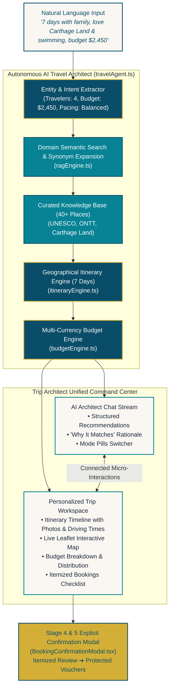

<div align="center">

# 🇹🇳 TuniTrip — AI-Powered Tunisia Travel Planner

<p align="center">
  <strong>The Intelligent Way to Discover Tunisia.</strong><br>
  <em>Next-generation autonomous travel architect designed for international visitors, families, and travelers.</em>
</p>

<!-- Animated Typing Subtitle -->
<p align="center">
  <a href="https://github.com/7amouch2k01-oss/TuniTrip">
    
  </a>
</p>

<!-- Shields / Badges -->
<p align="center">
  <a href="https://github.com/7amouch2k01-oss/TuniTrip/stargazers"></a>
  <a href="https://github.com/7amouch2k01-oss/TuniTrip/network/members"></a>
  
  
  
  
  
  
</p>

<p align="center">
  <a href="#-quick-start">Quick Start</a> •
  <a href="#-core-capabilities">Core Capabilities</a> •
  <a href="#-product-architecture">Architecture</a> •
  <a href="#-tested-investor-scenario">Investor Scenario</a> •
  <a href="#-verified-destinations">Destinations</a> •
  <a href="#-tech-stack">Tech Stack</a>
</p>

---

</div>

## 📌 Executive Summary

**TuniTrip** is a presentation-ready Tunisian travel platform built for foreign visitors and travelers who want to explore Tunisia through natural conversation, verified cultural insights, strict budget guardrails, and realistic geographical itineraries.

Rather than acting as a generic chatbot or static search dashboard, TuniTrip pairs an **Autonomous AI Travel Architect** side-by-side with an **Interactive Digital Notebook Workspace**. 

```
User Prompt (Natural Language)
      │
      ▼
AI Researches (Semantic RAG on UNESCO & ONTT Knowledge)
      │
      ▼
AI Understands Preferences (Family, Theme Parks, Calm Swimming, Budget: $2,450)
      │
      ▼
AI Recommends Curated Options (Carthage Land, Hasdrubal Thalassa, El Jem)
      │
      ▼
Trip Workspace Synchronizes (7-Day Realistic Schedule + Leaflet Interactive Map)
      │
      ▼
Budget Calculates Live (Itemized Accommodations, Transfers, Passes, Buffer)
      │
      ▼
Stage 4 Explicit Confirmation (Zero Unintended Charges, Verified Partner Vouchers)
```

---

## 🌟 Key Highlights & Innovations

<table>
  <tr>
    <td width="50%">
      <h3>🏛️ Authentic Grounding Layer (RAG)</h3>
      <p>Every activity, stay, and fee is grounded in authoritative Tunisian datasets from <strong>UNESCO World Heritage</strong>, <strong>Tunisian National Tourist Office (ONTT)</strong>, <strong>Carthage Land Official Park Authorities</strong>, and verified 4★ & 5★ hotel partners.</p>
    </td>
    <td width="50%">
      <h3>⏱️ Geographically Conscious Pacing</h3>
      <p>Calculates real driving times across Tunisian regions (Tunis-Carthage Airport to Hammamet in 50 min; Hammamet to El Jem in 90 min). Never schedules impossible travel leaps or exhausting daily jumps.</p>
    </td>
  </tr>
  <tr>
    <td width="50%">
      <h3>💰 Dynamic Multi-Currency Budget Engine</h3>
      <p>Live recalculations in <strong>USD ($)</strong>, <strong>EUR (€)</strong>, <strong>GBP (£)</strong>, and <strong>Tunisian Dinars (TND)</strong>. Itemizes accommodation, activities, private minivan transfers, food, and extras with a dedicated safe buffer.</p>
    </td>
    <td width="50%">
      <h3>🛡️ 5-Stage Consumer Protection Flow</h3>
      <p>Zero accidental financial transactions. TuniTrip mandates an explicit Stage 4 review where travelers authorize reservations before official reference vouchers (<code>TN-HTL-7741</code>, <code>CL-PAS-9921</code>, <code>TN-TRN-3418</code>) are generated.</p>
    </td>
  </tr>
  <tr>
    <td width="50%">
      <h3>🗺️ Synchronized Leaflet Mapping</h3>
      <p>Custom Mediterranean teal and gold pins, interactive route polylines, and popups synchronized directly with active day timeline selections.</p>
    </td>
    <td width="50%">
      <h3>✨ 4 Strategic Plan Modes</h3>
      <p>Instantly toggles between 4 strategically distinct itineraries: <em>Family Adventure ($1,480)</em>, <em>Calm Coast ($1,390)</em>, <em>Heritage & Imperial ($1,560)</em>, and <em>Budget-Smart ($1,150)</em>.</p>
    </td>
  </tr>
</table>

---

## 🏗️ Product Architecture



---

## 🎯 Tested Investor & Stakeholder Presentation Scenario

The platform comes with a dedicated **"Try Demo Trip"** flow that simulates an end-to-end conversation:

```markdown
1. USER INITIAL PROMPT:
   "Hello I wanna visit Tunisia for 7 days with 3 other family members. We love playing games like Disneyland or Carthage Land games. We love history and swimming and calm places. My budget is 2450 dollars."

   ✔ Profile Extracted: 4 Travelers · 7 Days · $2,450 USD Target · Family Trip
   ✔ RAG Top Match: Carthage Land Yasmine Hammamet (4.6★) & Hasdrubal Thalassa & Spa (4.8★)
   ✔ Budget Computed: $2,146 Total Est. with $304 safe buffer (88% of target)
   ✔ Itinerary: 7 geographically sequenced days (Tunis ➔ Carthage ➔ Hammamet ➔ Sousse ➔ El Jem ➔ Monastir)

2. CONVERSATIONAL ADJUSTMENT 1 (Accommodation Rerouting):
   "I like this plan but I don't want to stay in Tunis"
   ✔ Agent reroutes accommodation directly to calm beachfront resort in Yasmine Hammamet.

3. CONVERSATIONAL ADJUSTMENT 2 (Activity Swap):
   "Keep the hotel in Hammamet but replace the second activity"
   ✔ Agent intelligently preserves the Hammamet hotel while swapping the second activity with private catamaran sailing & calm cove swimming.

4. EXPLICIT STAGE 4 CONFIRMATION:
   "Perfect. Book it."
   ✔ Triggers zero-charge explicit confirmation review with itemized vouchers:
     • Hasdrubal Thalassa Suite (Ref: TN-HTL-7741)
     • Carthage Land Combo Passes (Ref: CL-PAS-9921)
     • Private Chauffeur Minivan (Ref: TN-TRN-3418)
```

---

## 🇹🇳 Curated Destinations Grounded in Knowledge Base

| Destination | Highlights | Curated Activities & Stays | Verified Source |
| :--- | :--- | :--- | :--- |
| **Tunis & Sidi Bou Said** | Blue-and-white cliffside village, panoramic sea views, Café des Délices | Sidi Bou Said Walking Tour, Medina of Tunis, Bardo Mosaic Palace, Dar El Jeld | ONTT & UNESCO World Heritage |
| **Carthage** | Punic naval ports, Roman baths, Byrsa Hill acropolis | Roman Baths of Antoninus, Carthage National Museum | UNESCO World Heritage |
| **Yasmine Hammamet** | Golden sand beaches, Mediterranean sea, modern marina & entertainment | Carthage Land Theme Park, Aqua Land, Hasdrubal Thalassa & Spa, Hammamet Medina | Carthage Land & ONTT |
| **Sousse & Monastir** | Ribat fortress, UNESCO Medina, Port El Kantaoui marina | Pirate Ship Catamaran Cruise, Monastir Ribat & Mausoleum, Medina of Sousse | Ministry of Cultural Affairs |
| **El Jem** | 3rd-century Imperial Roman Amphitheatre (Colosseum) | Colosseum Exploration, El Jem Archaeological Museum mosaics | UNESCO World Heritage |
| **Djerba Island** | Tranquil beaches, olive groves, whitewashed villages, synagogues | Radisson Blu Palace Thalasso, Djerbahood Street Murals, Houmt Souk | Djerba Tourism Board |

---

## ⚡ Quick Start

### Prerequisites
* **Node.js**: v18.0.0 or higher
* **npm**: v9.0.0 or higher

### Installation & Launch

```bash
# 1. Clone the repository
git clone https://github.com/7amouch2k01-oss/TuniTrip.git
cd TuniTrip

# 2. Install dependencies
npm install

# 3. Start local development server
npm run dev
```

Open [http://localhost:5173](http://localhost:5173) in your browser.

### Run Automated Scenario Verification Suite

```bash
npm test
```

Expected output:
```bash
====================================================
RUNNING TUNITRIP INVESTOR & USER SCENARIO TEST SUITE
====================================================
✓ [1] Extracted Profile: 4 Guests, 7 Days, $2450 USD Target
✓ [2] Verifying RAG Search: Carthage Land, Hammamet Plage, Hasdrubal Thalassa
✓ [3] Verifying Budget Engine: $2,146 Total Est. with $304 safe buffer
✓ [4] Verifying 7-Day Geographical Itinerary Pacing (7 full days)
✓ [5] Verifying 4 Distinct Strategic Plan Modes
✓ [6] Testing Conversational Modification 1 (Reroute away from Tunis)
✓ [7] Testing Conversational Modification 2 (Swap activity, preserve hotel)
✓ [8] Testing Booking Confirmation Trigger (Explicit Stage 4 flow)
====================================================
ALL TUNITRIP SCENARIO TESTS PASSED WITH 100% SUCCESS!
====================================================
```

### Production Build

```bash
npm run build
```

---

## 📁 Repository Structure

```
TuniTrip/
├── public/                      # Static SVG icons and favicon
├── src/
│   ├── assets/                  # Hero and scenic assets
│   ├── components/              # Editorial React UI components
│   │   ├── BookingConfirmationModal.tsx  # Stage 4 & 5 explicit review & vouchers
│   │   ├── ChatInterface.tsx             # Flagship V3 sticky AI Travel Architect
│   │   ├── ExploreView.tsx               # Curated Tunisian destination catalog
│   │   ├── Footer.tsx                    # Mediterranean editorial footer
│   │   ├── HeroLanding.tsx               # Cinematic full-bleed landing hero
│   │   ├── InteractiveMap.tsx            # Leaflet interactive map with custom pins
│   │   ├── Navbar.tsx                    # Sticky navigation with multi-currency picker
│   │   ├── PlaceDetailModal.tsx          # Magazine-style modal with photo galleries
│   │   ├── SavedPlacesView.tsx           # Saved bookmark collection
│   │   ├── SettingsModal.tsx             # Language, currency & API configuration
│   │   ├── StickyDestinationStory.tsx    # Interactive destination index
│   │   ├── StickyStorytelling.tsx        # Pinned crossfade scroll storytelling
│   │   ├── TripWorkspace.tsx             # Personalized trip command center (Tabs)
│   │   └── UnforgettableExperiences.tsx  # Handpicked experiences grid
│   ├── data/
│   │   └── knowledgeBase.ts              # 40+ curated places with verified citations
│   ├── services/
│   │   ├── budgetEngine.ts               # Multi-currency live calculation engine
│   │   ├── itineraryEngine.ts            # 7-day geographically paced route engine
│   │   ├── ragEngine.ts                  # Semantic domain search & synonym matcher
│   │   └── travelAgent.ts                # Autonomous conversational agent
│   ├── tests/
│   │   └── scenario.test.ts              # End-to-end automated scenario test suite
│   ├── types/
│   │   └── index.ts                      # Strict TypeScript data contracts
│   ├── App.tsx                           # Master application shell
│   ├── index.css                         # Tailwind CSS v4 design tokens & keyframes
│   └── main.tsx                          # React entry point
├── package.json
├── tsconfig.json
├── vite.config.ts
└── README.md
```

---

## 🎨 Visual Identity & Design Principles

* **Palette:**
  * **Primary:** Mediterranean Deep Teal (`#0A4D68`, `#088395`)
  * **Secondary:** Warm Sand & Ivory (`#FAF7F2`, `#EADBCE`)
  * **Accent:** Muted Tunisian Gold (`#D4AF37`, `#C5A059`)
  * **Supporting:** Soft Terracotta (`#D96B43`), Crisp White (`#FFFFFF`), Charcoal Slate (`#1E293B`)
* **Typography:**
  * **Headings:** *Playfair Display* & *Cormorant Garamond* (Editorial Travel Magazine)
  * **Interface & Body:** *Plus Jakarta Sans* & *Outfit* (High-legibility modern UI)
  * **Handwritten Accents:** *Caveat* (*"Ahlan wa Sahlan"*, *"Tunisia is waiting"*)
* **Strict Avoidance:** No generic purple AI gradients, no neon cyberpunk, no cramped SaaS boxes, and no deceptive auto-charging.

---

## 🗺️ Product Roadmap

- [x] **Phase 1: MVP Core** — Autonomous AI Agent, RAG Knowledge Base, 7-Day Itinerary Engine, Budget Engine.
- [x] **Phase 2: UI/UX V2** — Sticky scroll storytelling, luxury destination showcase, interactive Leaflet map.
- [x] **Phase 3: Flagship Workspace V3** — Sticky AI Travel Architect, unified command center, itemized booking vouchers, test suite.
- [ ] **Phase 4: Real-Time Partner APIs** — Direct live integration with Amadeus hotel inventory and Carthage Land ticketing.
- [ ] **Phase 5: Multilingual Expansion** — Native French and Tunisian Arabic (*Derja*) voice agent integration.

---

## 📄 License

Distributed under the **MIT License**. See `LICENSE` for more information.

---

<div align="center">
  <p>Crafted with pride for Tunisia 🇹🇳 • Designed for world-class tourism presentations</p>
  <p><strong><a href="https://github.com/7amouch2k01-oss/TuniTrip">⭐ Star TuniTrip on GitHub</a></strong></p>
</div>
